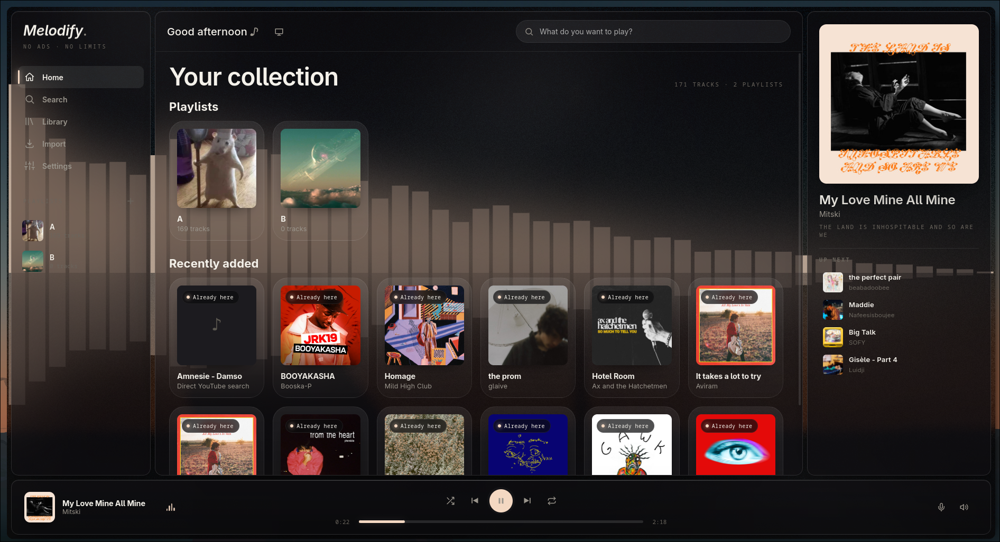
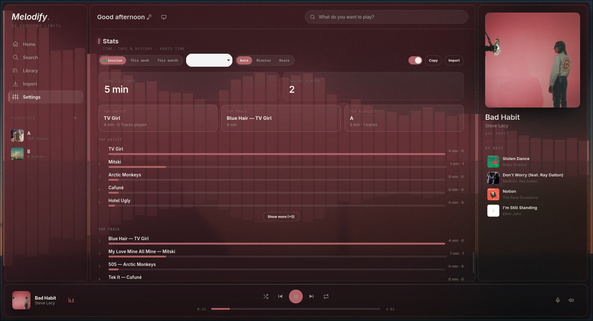

# 🚀 Melodify

<div align="center">


[](https://github.com/mundane-0/Melodify/stargazers)

[](https://github.com/mundane-0/Melodify/network)

[](https://github.com/mundane-0/Melodify/issues)

**A comprehensive web application for advanced music processing and real-time audio interaction.**

</div>

## 📖 Overview

Melodify is a web application designed to empower users with a wide array of music and audio processing capabilities. Built with a robust Python Flask backend and a dynamic HTML/JavaScript frontend, it integrates cutting-edge machine learning, real-time audio interaction via WebSockets, and powerful audio manipulation tools. Whether you're looking to analyze musical characteristics, recognize speech in audio, or manage your audio library, Melodify provides an intuitive and interactive platform.

## ✨ Features

-   **Advanced Audio Analysis**: Utilize `Librosa`, `NumPy`, and `SciPy` for deep insights into audio features such as tempo, rhythm, pitch, and timbre.
-   **Speech Recognition**: Interact with the application using voice commands or transcribe audio content using the `SpeechRecognition` library.
-   **Real-time Interaction**: Engage with music and application updates instantly through `Flask-SocketIO` powered WebSockets, enabling live feedback and dynamic controls.
-   **Music Playback & Management**: Seamlessly play, manage, and process audio files with `pydub` and `eyed3` for metadata editing.
-   **Web Content Integration**: Scrape and process web content, potentially for fetching music data, lyrics, or related information using `BeautifulSoup4`.
-   **Media Downloading**: Download audio and video content from various platforms, including *Spotify*, *YouTube*, *SoundCloud* and *Bandcamp*. *Spotify*  supports playlists
-   **Cross-Origin Resource Sharing**: Secure and flexible API communication enabled by `Flask-CORS`.
-   **Discord RPC**: Customizable Discord RPC via Client ID.
 
## 🖥️ Screenshots





## 🛠️ Tech Stack

**Frontend:**
-   **HTML5**
-   **CSS3**
-   **JavaScript** (Vanilla)
-   

**Backend:**
-   
-   
-   
-   
-   

**AI/ML & Audio Processing:**
-   
-   
-   
-   
-   
-   
-   
-   
-   
-   

## 🚀 Quick Start

### Prerequisites
-   **Python 3.8+**: Required for running the Flask backend and all associated libraries.
-   **pip**: Python package installer (usually comes with Python).
-   **ffmpeg/ffprobe**: For `pydub` to handle various audio formats. Install via your system's package manager (e.g., `sudo apt-get install ffmpeg` on Debian/Ubuntu, `brew install ffmpeg` on macOS).
-   Basic understanding of command-line operations.

### Installation

The repository includes an `install.sh` script to automate the setup process.

1.  **Clone the repository**
    ```bash
    git clone https://github.com/mundane-0/Melodify.git
    cd Melodify
    ```

2.  **Run the installation script**
    This script will create a Python virtual environment, install all dependencies from `requirements.txt`, and activate the environment.
    ```bash
    chmod +x install.sh
    ./install.sh
    ```
3.  ### **Then open your app manager and enjoy!**
## 📁 Project Structure

```
Melodify/
├── .gitignore          # Specifies files and directories to be ignored by Git.
├── README.md           # This comprehensive README file for the project.
├── app.py              # The main Flask application script, containing routes, logic, and possibly SocketIO handlers.
├── icon.png            # The application's icon or logo.
├── index.html          # The single-page HTML, CSS, and JavaScript frontend that the Flask server serves.
├── install.sh          # A shell script to automate the setup of the Python virtual environment and dependencies.
├── requirements.txt    # A list of all Python packages and their versions required by the project.
├── run.sh              # A shell script to execute the main server.py or app.py, starting the application.
└── server.py           # Additional backend server functionalities, potentially handling audio streaming, specialized API endpoints, or WebSockets.
```


### Configuration Files
-   `requirements.txt`: Manages all Python package dependencies.
-   `install.sh`: Configures the initial environment and installs dependencies.
-   `run.sh`: Orchestrates the application startup.
-   Python files (`app.py`, `server.py`): May contain hardcoded configurations or logic to load configurations from environment variables.

## 🔧 Development

### Available Scripts

| Command                               | Description                                                                 |

|---------------------------------------|-----------------------------------------------------------------------------|

| `chmod +x install.sh && ./install.sh` | Sets up the Python virtual environment and installs all required dependencies. |

| `chmod +x run.sh && ./run.sh`         | Starts the Melodify web server (Flask application).                        |

### Development Workflow
To contribute or develop on Melodify:
1.  Ensure you have run `./install.sh` to set up your development environment.
2.  Activate the virtual environment (this is typically done automatically by `run.sh` or within `install.sh`). If you need to manually activate: `source venv/bin/activate`.
3.  Modify the Python backend files (`app.py`, `server.py`) or the frontend (`index.html`).
4.  Run `./run.sh` to start the application and see your changes. For Python code changes, a server restart might be necessary.

## 🧪 Testing

Tested on Arch Linux with *HakuSpace* (Mango desktop environment, Sway window manager)

## 🚀 Deployment

### Production Build
There is no dedicated "build" step for the frontend as `index.html` is served directly. The Python backend is run directly.

### Deployment Options
For production environments, it is recommended to use `gunicorn`, which is included in `requirements.txt`, along with `eventlet` for robust handling of Flask applications, especially with `Flask-SocketIO`.

1.  **Ensure Dependencies are Installed**:
    ```bash
    chmod +x install.sh
    ./install.sh
    source venv/bin/activate
    ```
2.  **Run with Gunicorn**:
    Assuming your main Flask app object is named `app` within `app.py` or `server.py`, you can run:
    ```bash
    gunicorn -w 1 -k eventlet --bind 0.0.0.0:5000 app:app
    # Or, if your app object is in server.py:
    # gunicorn -w 1 -k eventlet --bind 0.0.0.0:5000 server:app
    ```
    _Note: For `Flask-SocketIO`, using `eventlet` worker class and potentially only one worker (`-w 1`) is often recommended to maintain WebSocket connections properly._

## 📚 API Reference

Melodify provides a set of API endpoints for interacting with its backend services and features. The frontend (`index.html`) communicates with these endpoints.

### Authentication
No explicit authentication mechanism was detected in the project. Access control is assumed to be handled by the deployment environment or through internal application logic.

### Endpoints
The following endpoints are inferred based on the project structure and dependencies:

| Method      | Endpoint                  | Description                                                                 |

| :---------- | :------------------------ | :-------------------------------------------------------------------------- |

| `GET`       | `/`                       | Serves the main Melodify frontend application (`index.html`).               |

| `GET`       | `/api/music`              | (Inferred) Retrieves a list of available music or audio tracks.             |

| `POST`      | `/api/analyze`            | (Inferred) Submits audio data for AI/ML-driven analysis (e.g., genre, sentiment). |

| `POST`      | `/api/speech-to-text`     | (Inferred) Processes uploaded audio content to convert speech to text.      |

| `POST`      | `/api/download`           | (Inferred) Requests downloading media content from a specified URL (e.g., YouTube). |

| `GET`       | `/audio/<track_id>`       | (Inferred) Streams a specific audio file from the server.                   |

| `WebSocket` | `/socket.io/`             | Establishes a real-time communication channel for interactive features and live updates. |

## 🤝 Contributing

### Vibe Coded with Qwen3.8-Max-Preview

## 🙏 Acknowledgments

-   **Flask Ecosystem**: For providing the robust web framework that powers Melodify.
-   **TensorFlow & Keras**: For enabling advanced machine learning and deep learning capabilities.
-   **OpenAI**: For integrating powerful AI models and services.
-   **Librosa, pydub, NumPy, SciPy, soundfile, eyed3**: For their comprehensive suite of audio processing and manipulation tools.
-   **SpeechRecognition**: For adding voice interaction capabilities.
-   **youtube_dl**: For enabling media downloads.
-   **BeautifulSoup4**: For facilitating web scraping functionalities.
-   **mundane-0**: The original author and maintainer of Melodify.

## 📞 Support & Contact

If you have any questions, encounter issues, or want to connect:

-   📧 Email: mundane@keemail.me
-   🐛 Issues: [GitHub Issues](https://github.com/mundane-0/Melodify/issues)
-   💬 Discussions: [GitHub Discussions](https://github.com/mundane-0/Melodify/discussions) <!-- TODO: Enable GitHub Discussions if desired -->

---

<div align="center">

**⭐ Star this repo if you find it helpful! ⭐**

Made with ❤️ by [mundane-0](https://github.com/mundane-0)

</div>

